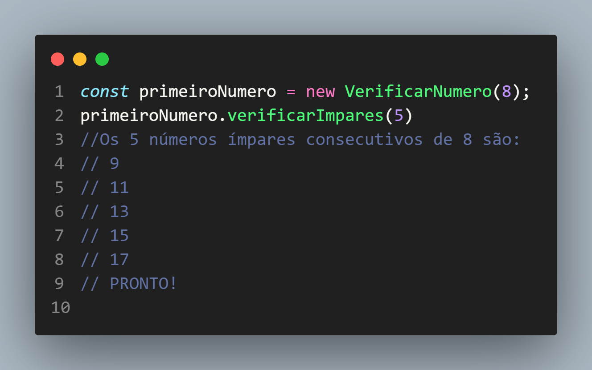
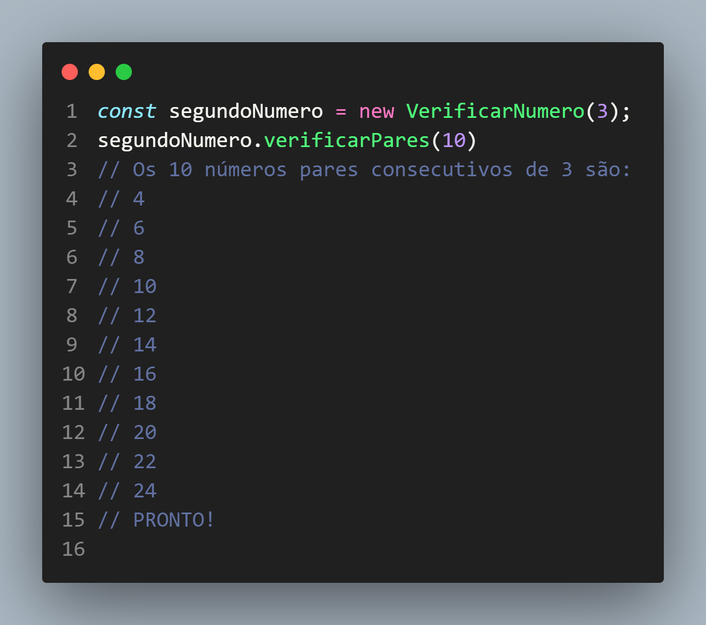

# Verificar Pares e Ímpares com POO - Javascript
## Criei este programa como forma de estudo a Programação Orientada a objetos.
Neste programa o usuário escolherá um número criando uma nova instância da classe "VerificarNumero" e irá passar como parâmetro um número qualquer.
Após isso, caso o usuário queira verificar quais são os números ímpares consecutivos desse número que ele escolheu anteriormente, ele pode chamar o método "verificarImpares()"
e passar como argumento a quantidade de números consecutivos que ele quer ver. Como no exemplo abaixo:

 

 

Caso o usuário queira verificar os números pares, ele pode chamar o método "verificarPares()" e passar como argumento a quantidade de números consecutivos que ele quer.
Como no exemplo abaixo:

 

 

https://ericksilverio10.github.io/POO-verificar-pares-e-impares/

# Espero que vocês tenham gostado! :)
